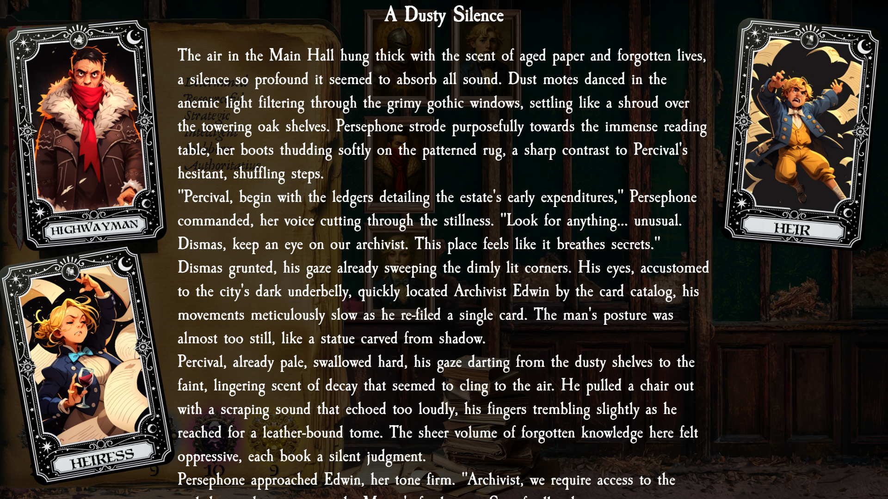

# Jed's Darkest Dungeon Companion
*A solo passion project to expand and enhance the world of Darkest Dungeon.*

---

## Overview
This project is a **companion app for Darkest Dungeon**, designed as an immersive tool to enrich the game's atmosphere with:
- Deep narrative events  
- Increased difficulty by altering the flow of the game and taking some decisions out of the player's hands
- A database of locations, lore, and consequences

Built primarily for personal use and experimentation with **TypeScript**, this is an ongoing project I develop in my spare time.

---

## Features
- **Character Profiles** – With backstories, stats, traits, and relationships  
- **Narrative Events** – Text-driven encounters that bring life to the estate.  
- **Party Interaction** – Characters interact through AI-driven storytelling, influenced by their personalities.  
- **World & Lore** – Structured data for hamlet districts and enemies.
- **Consequence System** – Event outcomes dynamically affect characters and the narrative state.

---

## Tech Stack
- **Language:** TypeScript  
- **Build Tool:** [Vite](https://vitejs.dev/) 
- **Approach:** Custom-built systems for narrative data, consequence processing, and event planning  

---

## Next Goals
- Create the tutorial section with the stagecoach crash
- Introduce a role system.
- Create the town hall planning, where a council prepares the month's expedition parties.
- Read and inject game data to live update health & stress based on events.

---

## Disclaimer
This is a **personal, non-commercial fan project** inspired by *Darkest Dungeon*.  
All rights to the original game belong to **Red Hook Studios**.  
Many assets were generated using AI.
